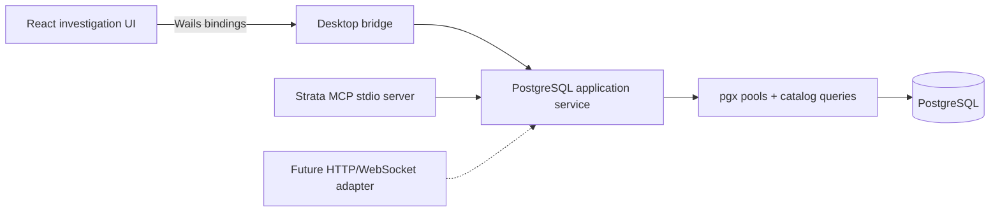

# Architecture

## Shape

The desktop bridge in `app.go` stays intentionally thin. PostgreSQL behavior lives in `internal/postgres`, so the desktop, MCP server, and future web transport share the same limits and introspection semantics.

## Frontend

- React and TypeScript with no component framework; the design language is project-owned CSS.
- CodeMirror is loaded as a separate chunk so the desktop frame can paint before editor parsing.
- Schema-aware SQL autocomplete uses `GetCompletionCatalog` (one round-trip of schemas → relations → columns) cached per connection.
- Multiple live `pgx` pools are exposed through the connection switcher; query tabs bind to a `connectionId`.
- `lib/api.ts` is the transport seam and only calls the Wails backend. Missing bindings or connections are explicit errors; no mock transport exists.
- The result grid is virtualized with `@tanstack/react-virtual`, capped at 10,000 rows, with CSV/JSON export and column visibility.

## PostgreSQL service

- Docker Compose supplies the development source of truth at `127.0.0.1:55432`. Versioned initialization scripts create representative PostgreSQL features and relational data.
- The desktop attempts this development connection during boot. Every field is environment-overridable, and failure leaves a visible disconnected state.
- `pgxpool` with six connections per profile, idle/lifetime limits, and `application_name=strata-desktop`.
- Catalog access is parameterized and excludes PostgreSQL-owned schemas by default.
- Desktop queries default to read-only and are bounded by timeout and row count.
- MCP queries are always read-only and receive a stricter 1,000-row cap.
- Query IDs register cancellation functions. M1 will additionally surface backend PID and `pg_cancel_backend` status.
- Values are normalized before crossing JSON boundaries, including numerics, UUIDs, timestamps, JSON, byte slices, and text marshalers.

## Natural language to SQL

The provider adapter belongs beside—not inside—the PostgreSQL service. Its planned pipeline is:

1. Select only relevant DDL, comments, relationships, and PostgreSQL version/extensions.
2. Ask the chosen model for structured output: SQL, assumptions, referenced objects, and confidence.
3. Parse and classify the SQL locally.
4. Reject multi-statement output and writes in read-only mode.
5. Run non-executing `EXPLAIN` to catch resolution/type errors.
6. Show a human-readable diff and require explicit execution.
7. Record question, context hash, model/provider, SQL, edits, and outcome in the investigation timeline.

No row values leave the database unless the operator explicitly adds them to context.

## Persistence

The detailed storage contract and security invariants are documented in [Local persistence](persistence.md).

- An embedded, migrated SQLite database is the source of truth for non-secret local state: connection profiles, scoped settings, workspace layout, SQL workbooks/documents, bounded revisions, and query-run metadata.
- Passwords live in the operating-system credential vault behind an opaque owner/purpose interface. SQLite stores only the vault provider, opaque key, and availability status.
- React uses typed Wails persistence methods. Browser storage is used only as a one-time legacy import source and is cleared after the backend commit succeeds.
- The current workspace is an autosaved workbook whose ordered, versioned documents can grow from SQL into notes, charts, and explain artifacts without changing the workbook identity model.
- Runtime connection IDs and result rows are ephemeral. Durable workbook documents bind to stable profile IDs, and private profiles skip executed-query history.
- Large future artifacts belong in an app-private content-addressed blob store rather than SQLite; that adapter is intentionally not needed until result snapshots or attachments ship.

## Testing strategy

- Unit tests cover normalization, limits, connection URI parsing, and MCP constraints.
- A live integration test verifies startup connection, catalog discovery, and read-only query execution against the versioned PostgreSQL container.
- Catalog fixtures must include partitions, enums, domains, generated columns, expression/partial indexes, materialized views, foreign tables, and restricted roles.
- Frontend CI builds TypeScript; interaction tests run against the live development fixture database.
- Release candidates are visually checked at the Wails minimum size and common high-DPI desktop sizes.
